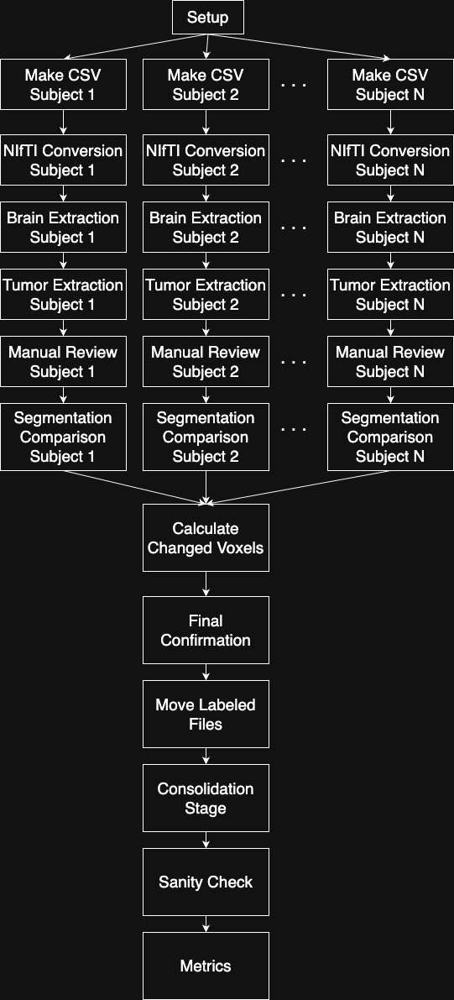
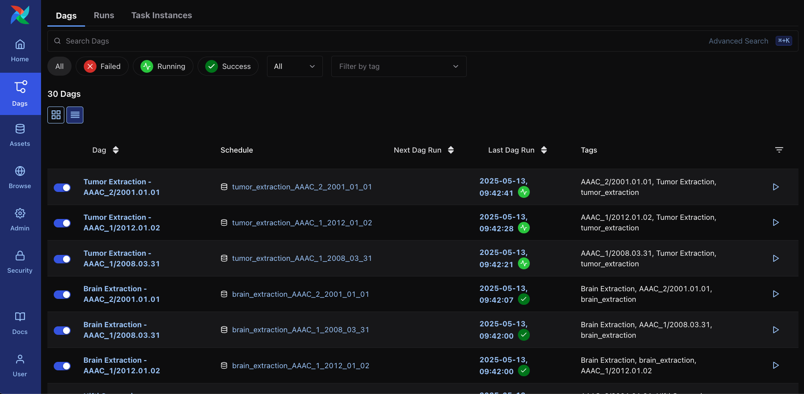
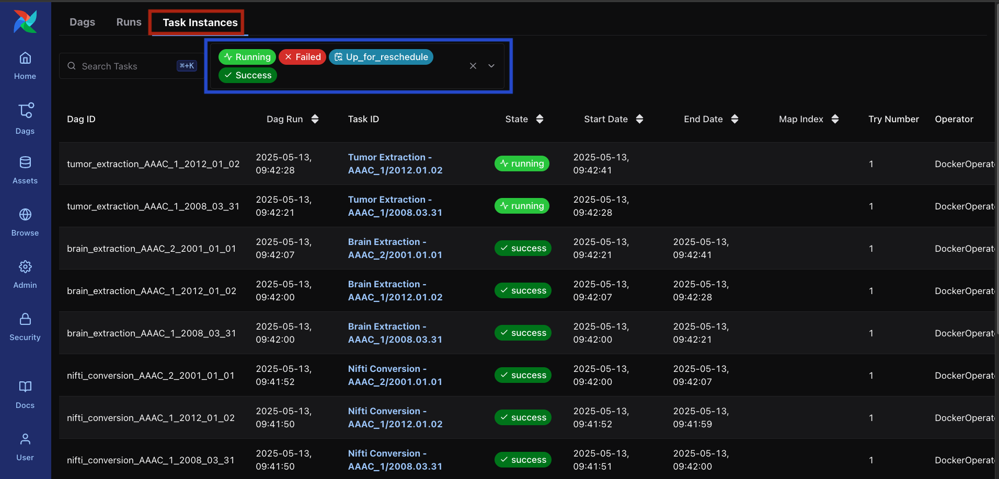
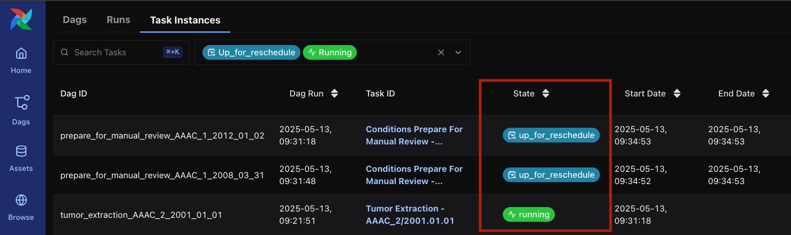
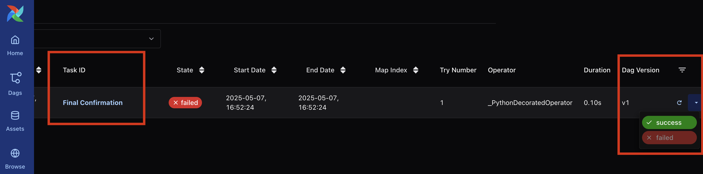
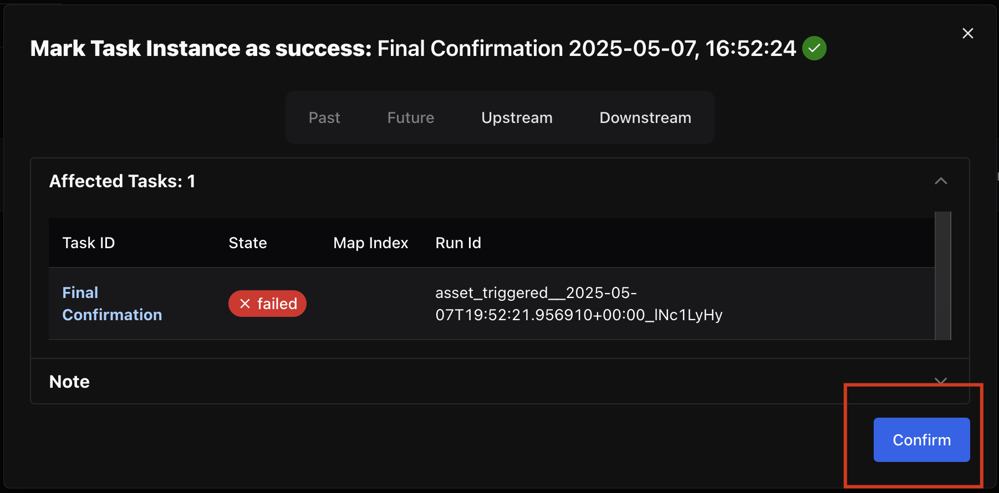

# RANO Data Preparation

Here, a modified version of the data preparation pipeline used in the RANO study is presented as a second use case for the YAML Pipelins in Airflow. The YAML file defining this pipeline is located at `dags_from_yaml/rano.yaml`, with auxiliary Python code used to evaluate conditional steps in the pipeline located at `dags_from_yaml/conditions.py`.

The Docker image used in this example is currently not available on a registry and must be therefore built from this repo. [Section 1](#1-building-the-rano-pipeline-docker-image) will go over the process of building this image and obtaining sample data to test the pipeline. [Section 2](#2-configuring-the-env-file-for-the-rano-pipeline) will then go over configuring the `.env.rano` file to run this pipeline and [Section 3](#3-running-the-rano-pipeline) will go over running the pipeline, including monitoring it in Airflow.

## 1. Building the RANO Pipeline Docker image
In the same directory as this file (that is, the `rano` directory), run the following command to generate the RANO Pipeline Docker image:

```shell
cd pipeline
sh build.sh
```
This may take some time to finish. At the end of the execution, two new Docker images will be created: `local/rano-data-prep-mlcube:1.0.14,` which is the RANO Data Preparation Pipeline image, and `local/fets_tool`, an intermediary image used in generating the Pipeline image. Note that the version tag in the local/rano-data-prep-mlcube may be different if the image is updated on a later date.

Real data for running the pipeline is not available in this repository. However, some downsampled data used for testing is available, as described in [Section 1.2](#12-using-the-development-image-for-testing) below.

### 1.1 Structuring your data

#### 1.1.1 Workspace Directory
If using real data, prepare a `workspace` directory in your Machine. This directory must have the contents of the `workspace` directory located at the same level as this README.md file, that is, it must include the `parameters.yaml` file. The workspace directory can be placed under any directory you prefer. Keep note of the complete path to this directory for the configuration step in [Section 2](#2-configuring-the-env-file-for-the-rano-pipeline).

```
.
├── workspace
│   └── parameters.yaml
```

#### 1.1.2 Output Data
Prepare a directory in your Machine to be the directory of the output data. This directory can be placed anywhere and have any name, but we recommend using a directory named `data` inside the `workspace` directory defined above. In this case, the directory structure would be:

```
.
├── workspace
│   ├── data
│   └── parameters.yaml
```
Keep note of the complete path to this directory for the configuration step in [Section 2](#2-configuring-the-env-file-for-the-rano-pipeline).

#### 1.1.3 Input Data
ou may create your `input_data` directory anywhere, but please ensure that it is in a location with relatively fast read/write access and with at least 2x more free disk space than your dataset currently occupies. Inside the `input_data` directory, your data needs to follow a folder hierarchy where images are separated by \<PatientID>/\<Timepoint>/\<Series>. We recommend making the `input_data` a subdirectory of the `workspace` directory defined previously, on the same level as the `data` directory. Keep note of the complete path to this directory for the configuration step in [Section 2](#2-configuring-the-env-file-for-the-rano-pipeline).

**Please note**: For the RANO study, Series-level folders must use the following abbreviations: t2f (T2-weighted FLAIR), t1n (T1-weighted non-contrast), t1c (T1-weighted with contrast), and t2w (T2-weighted). For more information about the required series, please refer to the FeTS 2.0 manual. PatientID and Timepoint must be unique between and within patients, respectively, and Timepoint should be sortable into chronologic order.

```
.
├── workspace
│  ├── data
│  ├── input_data
│  │   ├── AAAC_0
│  │   │   ├── 2008.03.30
│  │   │   │   ├── t2f
│  │   │   │   │   ├── t2_Flair_axial-2_echo1_S0002_I000001.dcm
│  │   │   │   │   └── ...
│  │   │   │   ├── t1n
│  │   │   │   │   ├── t1_axial-3_echo1_S0003_I000001.dcm
│  │   │   │   │   └── ...
│  │   │   │   ├── t1c
│  │   │   │   │   ├── t1_axial_stealth-post-14_echo1_S0014_I000001.dcm
│  │   │   │   │   └── ...
│  │   │   │   └── t2w
│  │   │   │       ├── T2_SAG_SPACE-4_echo1_S0004_I000001.dcm
│  │   │   │       └── ...
│  └──parameters.yaml
```


### 1.2 Using the Development image for testing
Downsampled images may be used for testing purposes, along with a modified Docker image to run them. Follow these instructions to run the development version of the pipeline with test data:

- Download and extract (sha256: 701fbba8b253fc5b2f54660837c493a38dec986df9bdbf3d97f07c8bc276a965):
<https://storage.googleapis.com/medperf-storage/rano_test_assets/dev.tar.gz>

- Move the `additional_files` and `input_data` directories to `workspace/additional_files` and `workspace/input_data` respectively. Also create a `data` directory inside `workspace`.

- Move the `tmpmodel`directory and `atlasImage_0.125.nii.gz` file into the `pipeline/project` directory.

- Build the Dev Docker Image from the Dockerfile.dev file located at `pipeline/project/Dockerfile.dev`. Starting from the same directory as this README.md file (`rano`), this step can be done with the following commands:

```shell
cd pipeline/project
docker build . -t local/rano-data-prep-mlcube-dev:1.0.14 -f Dockerfile.dev
```

- Edit the pipeline YAML file, located at `dags_from_yaml/rano.yaml` so that the `image` field (line 3) uses the dev image name (`local/rano-data-prep-mlcube-dev:1.0.14`)
  

## 2. Configuring the .env file for the RANO Pipeline
A `.env.rano` configuration file must be created to run this pipeline, similarly to what is described in the README.md file at the root of this repository for the CheXpert Pipeline.

Go back to the root of the repository and make a copy of the `.env.example` file, changing its name:

```shell
cp .env.example .env.rano
```

Then, modify each value of the new `.env.rano` file according to the instructions below.

- **AIRFLOW_IMAGE_NAME**: use the same image name as was used in [Section 1](#1-generate-the-airflow-docker-image). If the name provided in the tutorial was not changed, you can leave this value as is.
- **AIRFLOW_UID**: Set this to your user's UID in your system. This can be found by running `id -u`. This value is necessary to run Airflow as your current user in Docker, otherwise Airflow will be run as root inside the Docker container. If running as root in the container is acceptable, this value may be removed from the configuration file.
- **YAML_DAGS_DIR**: Set the **absolute** path to the `pipeline_examples/rano/dags_from_yaml` directory in this repository.
- **WORKSPACE_DIR**: If running on real data, this is **absolute** path to the `workspace` directory defined in [Section 1.1.1](#111-workspace-directory). If running the development dataset, set the **absolute** path to the `pipeline_examples/rano/workspace` directory.
- **INPUT_DATA_DIR**: If running on real data, this is **absolute** path to the `input_data` directory defined in [Section 1.1.3](#113-input-data). If running the development dataset, set the **absolute** path to the `pipeline_examples/rano/workspace/input_data` directory.
- **DATA_DIR**: If running on real data, this is **absolute** path to the `data` directory defined in [Section 1.1.2](#112-output-data). If running the development dataset, set the **absolute** path to the `pipeline_examples/rano/workspace/data` directory.
- **_AIRFLOW_USER**: Username for the Admin user in the Airflow UI, used to monitor runs.
- **_AIRFLOW_PASSWORD**: Password for the Admin user in the Airflow UI, used to monitor runs.
- **_AIRFLOW_POSTGRES_USER**: Username for the Postgres user that Airflow creates.
- **_AIRFLOW_POSTGRES_PASSWORD**: Password for the Postgres user that Airflow creates.
- **_AIRFLOW_POSTGRES_DB**: Name for the Database that Airflow creates in Postgres. 
  

## 3. Running the RANO Pipeline
Once the `.env.rano` file is properly configured, Airflow can be started via Docker Compose, at the root directory of this repo:

```shell
docker compose --env-file .env.rano -p rano up
```

This command starts a Docker Compose project named `rano` based on the env file `.env.rano`. The Airflow image is configured so that the pipeline will start immediately after the initial Airflow start up. The Airflow Web UI can be accessed at (http://localhost:8080/), using the **_AIRFLOW_USER** and **_AIRFLOW_PASSWORD** values defined in the `.env.rano` file as the Username and Password to monitor runs.

## 4. Pipeline Overiew
A general view of the pipeline is shown in the Figure below. A initial setup creating required directories is performed at first. Then, the pipeline will run NIfTI Conversion for multiple subjects in parallel. For each subject, once NIfTi conversion is completed, the pipeline will automatically run the Brain Extraction and Tumor Extraction stages and then await for manual confirmation (see [Section 5.1](#51-manual-approval-steps) for instructions regarding manual confirmation). The `per subject: true` configuration present in multiple steps of the pipeline signifies that this splitting per subject must be done at these steps.



When the parser converts the YAML file into Airflow, each box in the above Figure is converted into a Directed Acyclic Graph (DAG) in Airflow. This results in the Airflow form of the pipeline being constructed as multiple DAGs, which can be though of as a grouping of one or more data processing steps. The Airflow Docker image also has a Summarizer DAG is also present which is not part of the pipeline itself but rather writes a summary of the current execution status every 30 minutes, so the Benchmark Owner can track the study’s progress.

## 5. Monitoring in Airflow
Airflow’s Web UI can be used to monitor the Pipeline while it is running. It can be accessed via port 8080 in the Machine where Airflow is running. If running locally, you can simply open http://localhost:8080/ on your Browser to access the UI. Use the `_AIRFLOW_USER` and `_AIRFLOW_PASSWORD` defined in the `.env.rano` file from [Section 2](#2-configuring-the-env-file-for-the-rano-pipeline) to log in.


Once logged in, the Airflow home screen will be displayed, as shown below. You can click on the DAGs button, in red in the figure, to switch to the DAGs view.


A list of all currently loaded Airflow DAGs will be displayed, as shown below. The pipeline itself consists of multiple DAGs and each DAG maps to one of the `steps` defind in the YAML version of the Pipeline. Each DAG is the corresponding step name, both in its raw format from the YAML file (`some_step`) and in a more readable format (`Some Step`) and, in case of steps with `per_subject: true`, also by the Subject ID and Timepoint.



A view of Airflow Task Instances, which are the unit of execution used by Airflow, may be displayed by clicking the `Task Instances` button at the top of the screen. In this screen, Task Instances may be filtered by their state. We recommend filtering by `Running`, `Failed`, `Success` and `Up for Reschedule` states. The `Up for Reschedule` state is relevant for the Manual Approval Steps discussed in [Section 5.1](#51-manual-approval-steps). The Figure below shows a view of Task Instances with these filters applied, with the `Task Instances` button showcased in red and the state filters in blue.



### 5.1 Manual Approval Steps
The automatic Tumor Segmentations must be manually validated before the Pipeline concludes. To help with finding the tasks that are awaiting for Manual Approval, we recomend going into the Task Instance view described previously and filter by `Up for Reschedule` tasks. The pipeline automatically creates the `Conditions Prepare for Manual Review` task to evaluate the `if` fields from the `prepare_for_manual_review` step defined in the YAML file. While awating for approval, these tasks remain in the `Up for Reschedule` state. The Figure below shows a Task Instance list view in this situation, with the Task IDs and State in red:



In the Figure above, Subjects AAAC_1/2008.03.031 and AAAC_1/2012.01.02 are ready for manual review, signalled by the `State`  (in blue) column having the status `Up for Reschedule`. This status means that none of the conditions defined in step `prepare_for_manual_review` of the YAML file (`dags_from_yaml/rano.yaml`) have been met yet, and therefore the pipeline is waiting for their manual completion by a user. The procedure for Manual Review is described in Sections [5.1](#51-manual-approval-steps---tumor-segmentation) and [5.2](#52-brain-mask-correction). Subject AAAC_2/2001.01.01 on the other hand, has a currently running task, signalled by the `RUnning` state, and therefore is not ready for manual review yet.

#### 5.1.1 Tumor Segmentation
Once the segmentation for a given subject is ready for review, it will be available at the following path:

```
${DATA_DIR}/manual_review/tumor_extraction/{SUBJECT_ID}/{TIMEPOINT}/under_review/{SUBJECT_ID}_{TIMEPOINT}_tumorMask_model_0.nii.gz
```

Where `${DATA_DIR}` is the output data directory defined in [Section 1.1.2](#112-output-data),`{SUBJECT_ID}` and `{TIMEPOINT}` must be substituted for the corresponding SubjectID and Timepoint of each data point. Note that this is in the `under_review` directory, signalling the tumor segmentation has not been reviewed yet. For example, for subject AAAC_2 and timepoint 2001.01.01 the complete path would be:

```
${DATA_DIR}/manual_review/tumor_extraction/AAAC_2/2001.01.01/under_review/AAAC_2_2001.01.01_tumorMask_model_0.nii.gz
```

The tumor segmentation can be reviewed with the software of your choice and, if necessary, corrections can be made. Once the review is finished, the file must be moved to the adjacent `finalized` directory. The complete path to the `finalized` file is, then

```
${DATA_DIR}/manual_review/tumor_extraction/{SUBJECT_ID}/{TIMEPOINT}/finalized/{SUBJECT_ID}_{TIMEPOINT}_tumorMask_model_0.nii.gz
```

Where `${DATA_DIR}` is the output data directory defined in [Section 1.1.2](#112-output-data), `{SUBJECT_ID}` and `{TIMEPOINT}` must be substituted for the corresponding SubjectID and Timepoint of each data point. Note that this is in the `finalized` directory, signalling the review has been done. Once the Tumor Segmentation is in the `finalized` directory, the pipeline will automatically detect it and proceed for this subject. ***IMPORTANT!! Do NOT change the filename when moving the file into the finalized directory!*** The pipeline will only detect the reviewed Tumor Segmentation if it keeps the exact same filename.

Please do this review process for all subjects in the study. If the brain mask itself must be corrected for any subjects, please refer to [Section 5.1.2](#512-brain-mask-correction). Note that modifying the Brain Mask of a Subject will cause the pipeline to rollback to the Brain Extraction step corresponding to that subject to run again, after which the given Tumor Segmentation must be manually approved once ready.

#### 5.1.2 Brain Mask Correction

If the automatic brain mask is correct, no action from this section is required. However, it is also possible to make corrections to the automatic brain mask, if necessary. **Note that if the Brain Mask is modified, the pipeline will go back to the Brain Extraction stage for this subject, then run Tumor Extraction and await for manual approval once again oncfe the Tumor Extraction is completed.** Once the pipeline reaches the manual approval step for a given subject/timepoint, the brain mask file will be located at the path below:

```
${DATA_DIR}/manual_review/brain_mask/{SUBJECT_ID}/{TIMEPOINT/under_review/brainMask_fused.nii.gz
```

Where ${DATA_DIR} is the output data directory defined in [Section 1.1.2](#112-output-data), `{SUBJECT_ID}` and `{TIMEPOINT}` must be substituted for the corresponding SubjectID and Timepoint of each data point. Note that this is in the `under_review` directory, signalling the tumor segmentation has not been reviewed yet. 

The brain mask can be reviewed and corrected with the software of your choice and, if necessary, corrections can be made. Once the corrections are finished, the file must be moved to the adjacent `finalized` directory. The complete path to the finalized file is, then:

```
${DATA_DIR}/manual_review/brain_mask/{SUBJECT_ID}/{TIMEPOINT/finalized/brainMask_fused.nii.gz
```

***IMPORTANT!! Do NOT change the filename when moving the file into the finalized directory!*** The pipeline will only detect the corrected Brain Mask if it keeps the exact same filename.

#### 5.2 Final Confirmation
There is also a manual confirmation step towards the end of the pipeline (step ID `final_confirmation`, of type  `manual_approval`). When converted into an Airflow task, this step results into a task that always fails and must be manually set as Success by the user. **Before proceeding with this step, *make sure to review and Tumor Segmentations as per [Section 5.1.1](#511-manual-approval-steps---tumor-segmentation) and ensure you approve all of the results, along with necessary corrections to Brain Masks ([Section 5.1.2](#512-brain-mask-correction) if any are necessary.***

Once all results are reviewed, log into Airflow's Web UI. Go into the Task Instance View and locate the Task Instance named `Final Confirmation`. A filter by may be used, as shown in the Figure below, in blue. The task state will be `Failed`, as shown in red in the figure. This is normal, as this task is a manual approval step and therefore must be manually changed to success for approval.


***IMPORTANT!!* This task will *NOT* show up if all Manual Reviews are not done yet!** If you are unable to find the `Final Confirmation` task instance, make sure you have completed all the Manual Review steps outlind in [Section 5.1](#51-manual-approval-steps).

If task is in the `Failed` state, it is ready for review. **If you have already validated all the Tumor Segmentations**, scroll your display all the way to the right, revealing a small drop-down arrow. Click the arrow, then click `Success` to open a confirmation prompt. The `Note` tab may be optionally expanded to add a Note to this task, if desired. Finally click `Confirm` to approve the results.  The two figures below illustrate this process.





Once this procedure is done, the pipeline will proceed to its final steps and conclusion.

## 6. Output Data

The outputs of the pipeline, upon its conclusion, are as follows:

- The `report_summary.yaml` file, located at `${WORKSPACE_DIR}/report_summary.yaml` which is updated every 30 minutes with the completion percentages of each step defined on the Pipeline YAML file (`dags_from_yaml/rano.yaml`)

- The `${WORKSPACE_DIR}/metadata` directory contains metadata YAML files for each subject, extracted from the initial DICOM data.

- The `${WORKSPACE_DIR}/labels` directory contains the final tumor segmentations for each subject.

- The `${DATA_DIR}` directory contains two different outputs.
  - The NIfTi files obtained for each subject after Brain Extraction, located at `${DATA_DIR}/{SUBJECT_ID}/{TIMEPOINT}` for each subject/timepoint combination.
  - A `splits.csv` file detailing whether each subject was separated into the training or validation data sets.
  - A `train.csv` file containing only subjects in the training dataset.
  - A `val.csv` file containing only subjects in the validation dataset. 

- `${WORKSPACE_DIR}`, `${DATA_DIR}` and `${INPUT_DATA_DIR}`refer to the variables set at the `.env.rano` file from [Section 2].(#2-configuring-the-env-file-for-the-rano-pipeline)